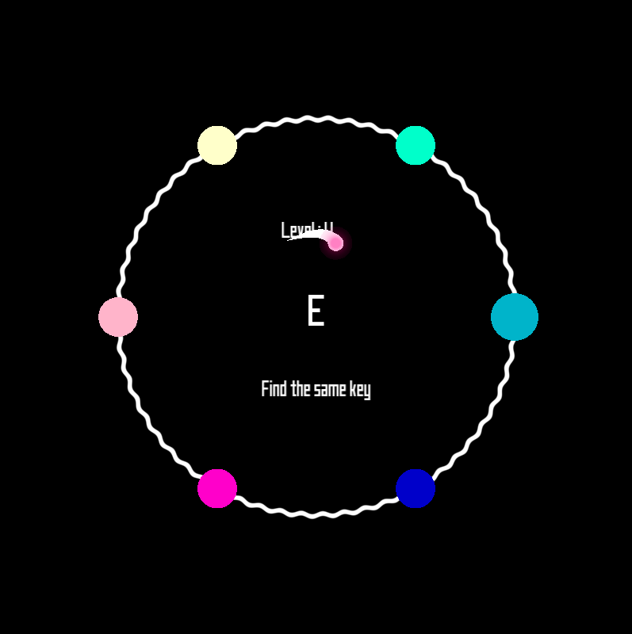

# Lost In Sound

Lost In Sound is a music game developped in c++ during a 48 hours game jam.

You play as billy, a particle lost in space, and your goal is to find its way back to its main galaxy.
Billy has something special, it can hear sounds through portals which leads to differents galaxies, and then maybe find its way!

### Tutorial ###
Pass your mouse on the differents circles and follow the rule written in the main circle.
Control the particle using ZQSD.

## How to play ##

The game is ONLY made for Windows.

1. Download this repository, it can be done using `git clone https://github.com/AntoineBRTL/LostInSound.git`.
2. Execute `launcher.bat` or open a cmd instance from the root directory and execute `.\bin\LostInSound.exe`.
3. May be the sound with you !

# Recompile the game #

### With GCC 11.2.0 ###

To recompile the game you will need `g++ 11.2.0` and [SFML](https://www.sfml-dev.org/) compiled for this same version.
Then, execute using powershell the following command : 

`g++ ./src/*.cpp -o bin/LostInSound.exe -I include -I src -L lib -lsfml-graphics -lsfml-window -lsfml-system -lsfml-audio -lwinmm;`

### With any other versions ###

To recompile the game with your version of `g++`, you need to recompile [SFML](https://www.sfml-dev.org/tutorials/2.0/compile-with-cmake.php) and execute the command seen above. And Voila your game is up to date with your version of `g++`.

